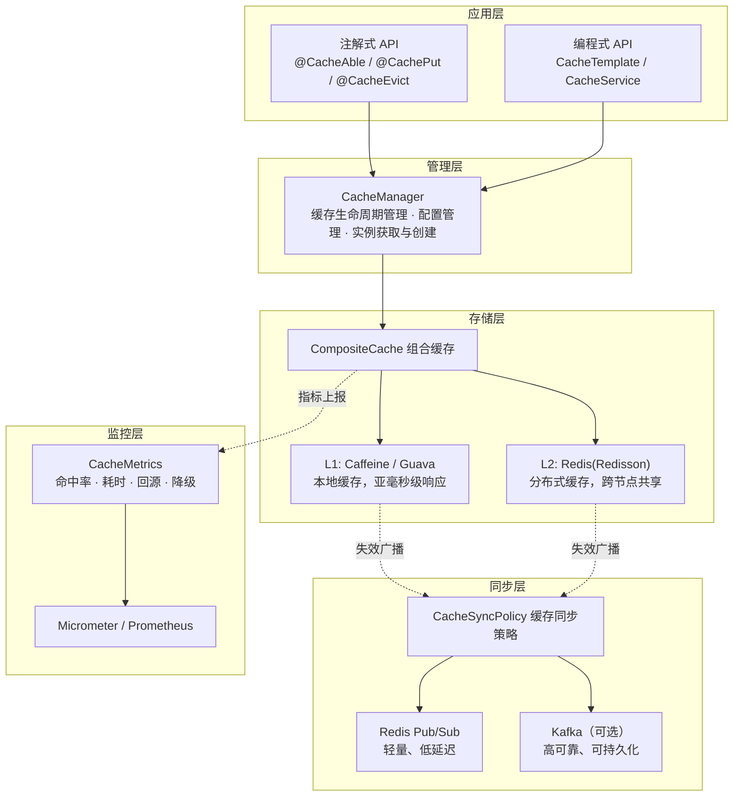
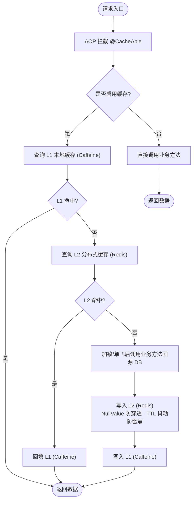
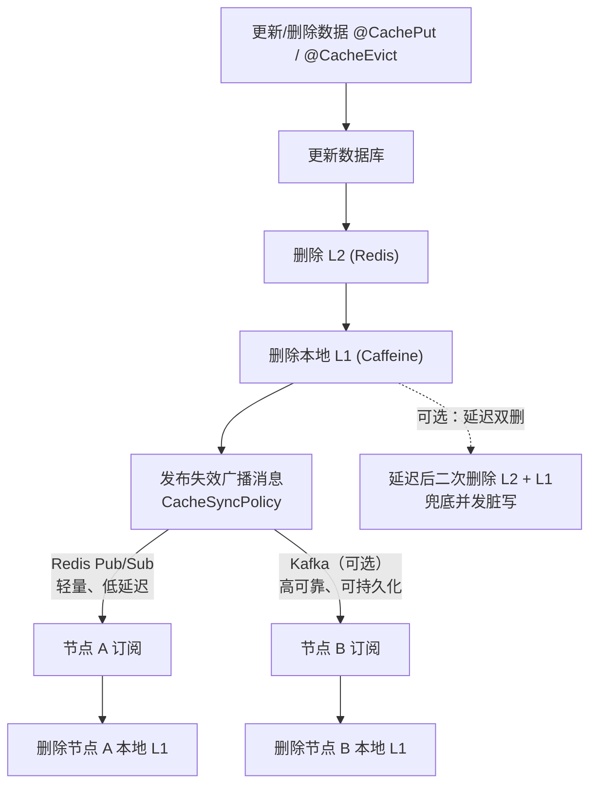

# Composite Cache - 多级缓存组件

[](LICENSE)
[](https://www.oracle.com/java/)
[](https://spring.io/projects/spring-boot)
[](https://github.com/ben-manes/caffeine)
[](https://github.com/google/guava)
[](https://redisson.org/)
[](https://redis.io/)

## 📖 项目简介

Composite Cache 是一个高性能、易扩展的多级缓存框架，支持一级缓存（本地缓存）和二级缓存（分布式缓存）的组合使用。通过注解和编程式API两种方式，让缓存使用更加灵活便捷。

### 核心特性

- ✅ **多级缓存架构**：L1（本地缓存）+ L2（分布式缓存）+ 回源 DB 自动组合
- ✅ **多种缓存实现**：
  - L1：Caffeine（默认、推荐）、Guava（可选）
  - L2：Redis（基于 **Redisson**；底层 String/RBucket）
- ✅ **注解 + 编程式双入口**：`@CacheAble`/`@CachePut`/`@CacheEvict` 简化使用；`CacheTemplate`/`CacheService` 处理注解表达不了的动态、批量、复杂场景（二者同源、命中同一缓存项）
- ✅ **防穿透**：空值缓存（NullValue）+ 可选布隆过滤器前置拦截
- ✅ **防击穿**：`LOCK`（本地锁 + 分布式锁两级单飞）/ `LOGICAL_EXPIRE`（逻辑过期 + 异步刷新）
- ✅ **防雪崩**：TTL 随机抖动打散集中过期
- ✅ **一致性**：先删 L2 再删 L1 + 跨节点 L1 失效广播（Redis Pub/Sub 或 Kafka）+ 延迟双删 + 删除失败补偿
- ✅ **高可用**：L2 运行期熔断降级（Redis 抖动时降级 L1 + 回源、自动恢复）
- ✅ **可观测**：统一指标（命中率/耗时/回源/降级），可对接 Micrometer/Prometheus
- ✅ **批量操作**：批量获取/写入/删除、批量回源、级联加载
- ✅ **Spring Boot 集成**：开箱即用的 Starter

## 🚀 快速开始

添加依赖后，配置 Redis 连接信息，即可开始使用注解或编程式 API。

```xml
<dependency>
    <groupId>io.github.nitouge</groupId>
    <artifactId>composite-cache-spring-boot-starter</artifactId>
    <version>1.0.0-SNAPSHOT</version>
</dependency>
```

详细的配置说明、注解用法、编程式 API、高级特性请查阅文档：

- [用户指南](docs/USER_GUIDE.md) — 快速上手、注解说明、编程式 API、批量操作
- [配置指南](docs/CONFIGURATION_GUIDE.md) — 完整配置项说明、缓存难题对应配置

## 🏗️ 架构设计

### 分层架构



### 分层设计思路

| 层级 | 职责 | 关键设计 |
| --- | --- | --- |
| **应用层** | 提供两种使用入口 | 注解式适合简单声明场景；编程式（`CacheTemplate`/`CacheService`）覆盖自调用、动态 key、批量部分命中等注解表达不了的场景，二者同源、命中同一缓存项 |
| **管理层** | 统一管理缓存实例 | `CacheManager` 按 `cacheName` 懒加载创建并持有 `Cache` 实例，集中管理配置 |
| **存储层** | 多级缓存组合 | L1 极速响应、L2 跨节点共享；L2 故障时可运行期降级为仅 L1 + 回源 |
| **同步层** | 保证分布式一致性 | 先删 L2 再删 L1 + 跨节点广播通知其他实例失效本地 L1，避免脏读 |
| **监控层** | 全方位可观测 | 统一指标采集（命中率/耗时/回源/降级），可对接 Micrometer/Prometheus |

### 技术选型理由

| 组件 | 选型 | 理由 | 备选方案 |
| --- | --- | --- | --- |
| **L1 缓存** | Caffeine | 基于 W-TinyLFU 算法，命中率和吞吐优于 LRU 类实现；支持同步/异步加载 | Guava |
| **L2 缓存** | Redis + Redisson | 成熟稳定；提供分布式锁、RTopic 广播、RBatch 管道等能力，不止是 KV 存储 | Memcached、Hazelcast |
| **同步机制** | Redis Pub/Sub | 轻量、无需额外组件、延迟低；Kafka 作为可选项服务于对可靠性要求更高的场景 | Kafka |
| **监控** | Micrometer | Spring Boot 官方推荐的指标门面，可对接 Prometheus/Grafana 等多种后端 | 直接埋点日志 |

### 核心流程

**读取流程**：L1 → L2 → DB（回源） → 写回 L2 → 写回 L1  
**写入策略**：同时写入 L1 和 L2  
**删除策略**：先删 L2 再删 L1 + 跨节点广播（保证一致性）

> 为什么先删 L2 再删 L1：L2 是跨节点共享的，若先删 L1，其他节点仍可能从 L2 读到旧值并回填自己的 L1；先删 L2 能保证之后任何节点都无法再从 L2 取到旧数据，最后删本地 L1 并广播通知其他节点清除各自的 L1。

### 读写全流程





> 图中"节点 A / 节点 B"代表集群中其他应用实例：每个实例启动时通过 `CacheSyncPolicy` 订阅广播（Redis Pub/Sub 或 Kafka），收到失效消息后清除各自的本地 L1，从而避免其它节点读到 L2 已删除、但本地 L1 仍缓存旧值的情况。

### 模块结构

```text
composite-cache/
├── composite-cache-annotation          # 注解定义 + AOP 切面
├── composite-cache-core                # 核心缓存实现
├── composite-cache-spring-boot-starter # Spring Boot 自动配置
└── composite-cache-test                # 测试示例项目
```

| 模块 | 职责 |
| --- | --- |
| **composite-cache-annotation** | 注解定义：`@CacheAble` / `@CachePut` / `@CacheEvict` / `@BatchCacheAble`；AOP 切面：`LayeringAspect` 拦截注解并执行缓存逻辑；Key 生成器：SpEL 表达式解析和缓存 Key 生成。 |
| **composite-cache-core** | 缓存接口：`Cache` / `L1Cache` / `L2Cache` / `CompositeCache`；缓存实现：`CaffeineCache` / `GuavaCache` / `RedissonRBucketCache`；缓存管理：`CacheManager` / `CacheProvider` / `CacheTemplate`；高级特性：防穿透（空值缓存 + 布隆过滤器）、防击穿（分布式锁 + 逻辑过期）、防雪崩（TTL 随机抖动）、一致性保证（延迟双删 + 删除补偿）、运行期降级（熔断器）；同步策略：`CacheSyncPolicy` + Redis Pub/Sub / Kafka；监控指标：`CacheMetrics` + Micrometer 集成。 |
| **composite-cache-spring-boot-starter** | 自动配置：`CompositeCacheAutoConfiguration` 自动装配所有组件；配置属性：`CompositeCacheProperties` 绑定 `composite-cache.*` 配置；开箱即用：引入依赖即可使用，无需任何 `@Enable` 注解。 |
| **composite-cache-test** | 完整示例：用户/商品管理 REST API；测试用例：单元测试 + 集成测试；验证场景：注解方式 + 编程式 API + 批量操作 + 缓存同步。 |

## 🧪 测试项目

项目包含完整的测试示例，位于 `composite-cache-test` 模块，演示注解方式、编程式 API、批量操作、缓存同步等场景。

启动方式和 API 测试请参考：[快速开始文档](QUICK_START.md)

## 🤝 贡献指南

欢迎提交 Issue 和 Pull Request！

## 📄 License

Apache License 2.0

## 📮 联系方式

如有问题或建议，欢迎通过 Issue 反馈。
